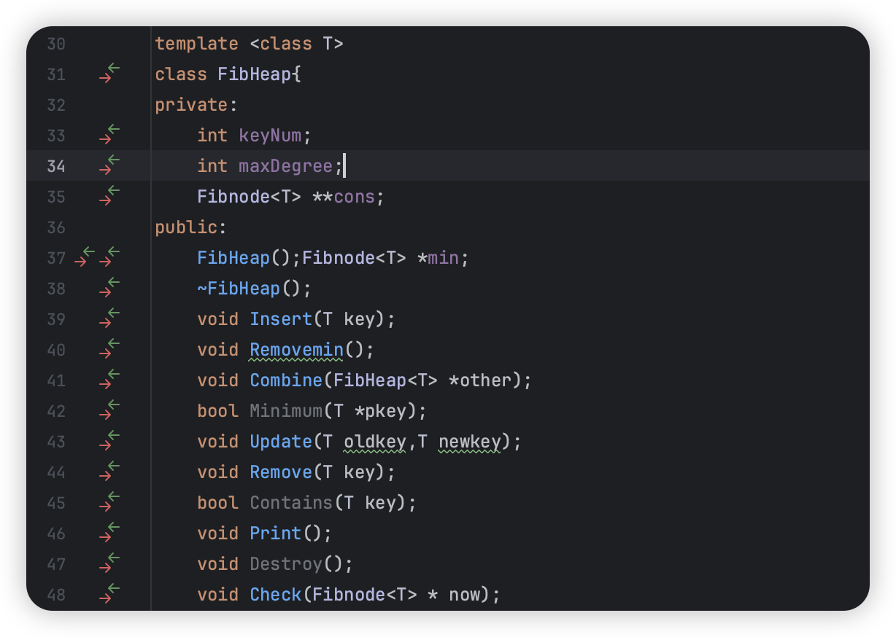
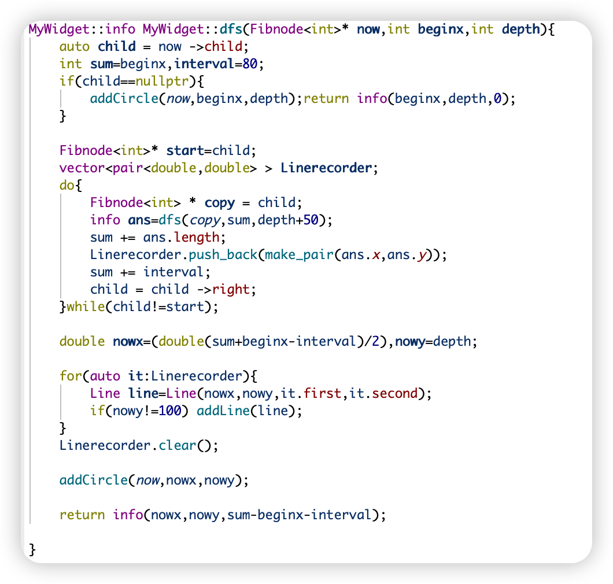
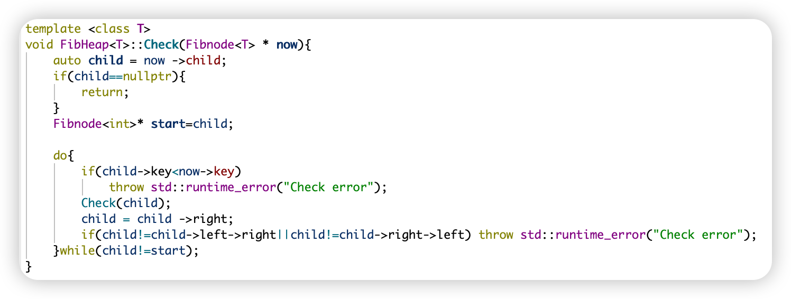
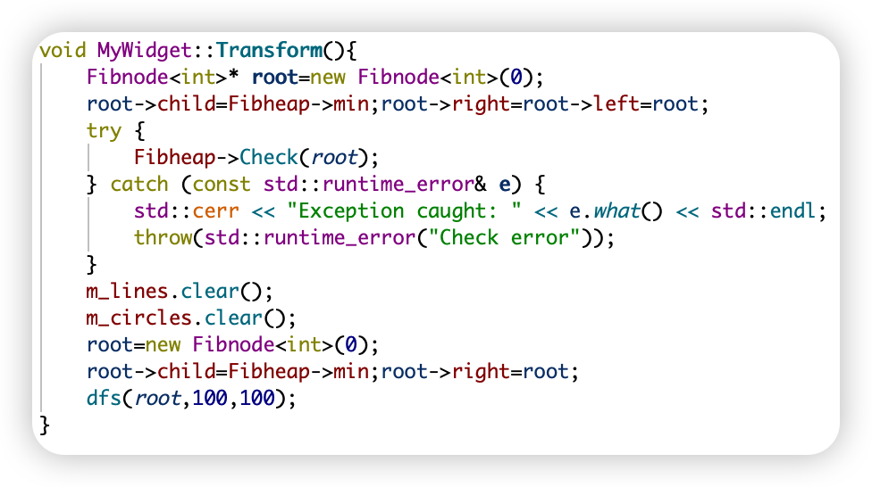
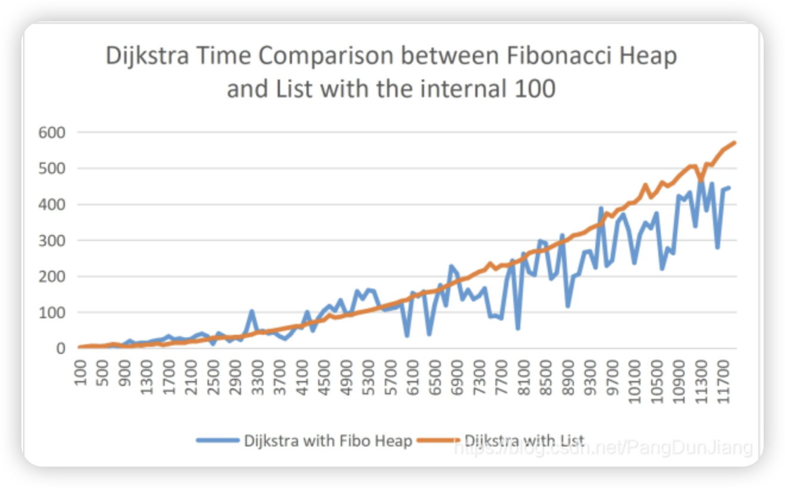

# 
 DS作业汇报 Fibonacci堆 

 detect0530@gmail.com 

# 探究Fibonacci堆对dijkstra算法的优化效果

1. 复杂度分析，与常见堆结构的理论横向对比
2. 实现Fibonacci堆
3. 验证Fibonacci堆的正确性
   - 利用qt实现可视化效果，方便调试
   - 设定check函数，自动检测堆性质以及双向链表的正确性
   - 与其他堆以及stl提供的priority_queue进行对拍比较
4. 将正确性得到保证的Fibonacci堆应用到dijkstra算法中，并在随机&高压数据集上进行测试，并记录实验结构
5. 分析实验结果，得出结论

## 理论复杂度对比

|    操作 `\` 数据结构   |                                       配对堆                                        |    二叉堆    |    左偏树    |        二项堆        |     斐波那契堆     |
| :-----------------------------: | :---------------------------------------------------------------------------------: | :----------: | :----------: | :------------------: | :----------------: |
|         插入（insert）          |                                       $O(1)$                                        | $O(\log n)$  | $O(\log n)$  |  $O(\log n)$  |       $O(1)$       |
|     查询最小值（find-min）      |                                       $O(1)$                                        |    $O(1)$    |    $O(1)$    | $O(1)$ |       $O(1)$       |
|    删除最小值（delete-min）     |                                 $O(\log n)$                                | $O(\log n)$  | $O(\log n)$  |     $O(\log n)$      | $O(\log n)$ |
|          合并 (merge)           |                                       $O(1)$                                        |    $O(n)$    | $O(\log n)$  |     $O(\log n)$      |       $O(1)$       |
| 减小一个元素的值 (decrease-key) | $o(\log n)$（下界 $\Omega(\log \log n)$，上界 $O(2^{2\sqrt{\log \log n}})$）| $O(\log n)$  | $O(\log n)$  |     $O(\log n)$      |   $O(1)$   |
|        是否支持可持久化         |                                      $\times$                                       | $\checkmark$ | $\checkmark$ |     $\checkmark$     |      $\times$      |

在dijkstra算法中，我们需要频繁的进行insert操作，而Fibonacci堆在insert操作上有着极大的优势，因此我们期望Fibonacci堆在dijkstra算法中有着更好的表现。

## 实现Fibonacci堆

一步步实现即可。

为了更好的可拓展性，对标stl里的priority_queue，我采用template类模板的方式实现了Fibonacci堆。

这样在之后的qt可视化实验以及dijkstra算法的实验中，可以方便的用不同type的实例化调用Fibonacci堆。

## 验证Fibonacci堆的正确性

#### Qt实现可视化

- 通过分别计算每个节点的x，y坐标，然后利用QPainter进行绘制线、圆、数字等操作，实现了Fibonacci堆的可视化。
- 会对marked的节点和minimum节点进行特殊颜色标记，方便调试。

- **注意了Fibonacci堆的结偶性，没有在Fibnode内单独添加x,y坐标储存，而是仅利用一次树遍历得到所有的graph信息。**

#### 设定check函数

检查了堆性质以及双向链表的正确性。

**将上述两点结合起来，在实现从数据结构转化到graph的transform function里，我们可以方便的调试Fibonacci堆。**

#### 与其他堆以及stl提供的priority_queue进行对拍比较

这里我使用大量的随机数据以及强力数据（针对一些极限情况的考虑，比如针对spfa最短路算法的最劣图构造）针对dijkstra算法需要的insert和remove_min操作进行了对拍，确保Fibonacci堆的正确性。

## 基于不同堆算法的dijkstra算法性能测试

这里我主要对比用priority_queue、Fibonacci堆以及list实现的dijkstra算法在随机图和强力图上的表现。

#### 理论分析：

约定，节点数为n，边数为m。

- list
    insert: $O(1)$
    remove_min: $O(n)$
    max: $O(n^2)$
- priority_queue
    insert: $O(\log n)$
    remove_min: $O(\log n)$
    max: $O((n+m) \log n)$
- Fibonacci堆
    insert: $O(1)$
    remove_min: $O(\log n)$
    max: $O(m + n \log n)$

有了可靠的fibonacci堆，我们得意开展有效的对比实验。

为保证对比实验严谨，我使用完全相同的实现方式（包括io接口），只是在堆的选择上进行了更换。

#### 在较弱数据下的实验结果

从上到下，分别是priority_queue和fibonacci堆在同样的十个数据集上运行的时间总和。

可以看到即使打开了对stl特友好的o2优化，fibonacci堆在较弱数据下也有着优势。list的表现是严重超时。

#### 在强数据下的实验结果

节点在1e5数量级，边在2e5数量级，构图采取了一些极限情况的考虑，比如针对spfa最短路算法的最劣图构造。

1. priority_queue 915ms
2. fibonacci_heap  692ms
3. priority_queue -o2 341ms
4. fibonacci_heap -o2  454ms
5. list $\infin$ms

可以看到，在正常编译环境下，fibonacci堆在强数据下有着更为显著的优势(25% off)。

但是打开o2变异优化后，stl中的priority_queue算法完成了反超，o2对stl系列操作优化太大，另外我手撸的fibonacci堆实现比较粗糙，没有进行过多的优化。

#### 针对随机图的实验结果

我引用相关论文的实验结果：

由于随机图有着许多美好的性质，使得list在随机图上的期望运行时间有很好的上限保证，而fibonacci堆常数较大，此消彼长，在随机图上并没有拉开太大的差距。

## Summary

最后，对实验结果进行了分析，得出结论：
- Fibonacci堆在dijkstra算法中有着更好的表现，并且随着图越稠密，优势会越大。
- Fibonacci堆比list理论上全方位更优秀，只有在随机图上，list可以接近它的表现。
- Fibonacci堆常数较大，实现复杂，在实际应用中需要权衡。
